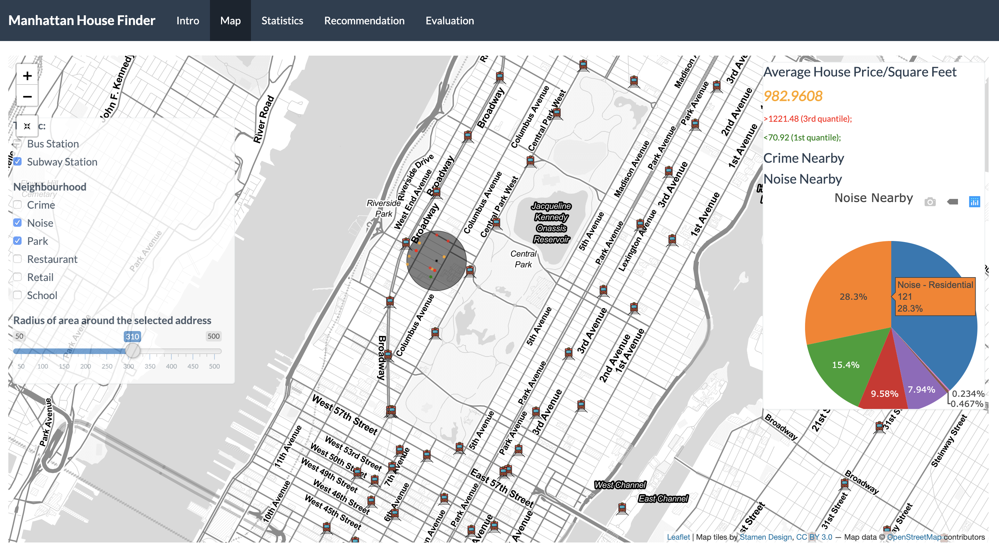

# Project 2 Shiny App Development
##### Group Project by Shuxin Chen, Junyan Guo, Xiyao Yan, Zhao Ziqin, Marsya Chairuna



## Manhattan House Finder
[Click here to access the shiny app web page](https://zhaoziqin.shinyapps.io/shiny2/)  
Term: Spring 2020 

#### Team 3
+ Shuxin Chen
+ Junyan Guo
+ Xiyao Yan
+ Ziqin Zhao
+ Marsya Chairuna

#### Project Summary 
We designed an app to discover sold homes and properties to find customers' ideal homes and properties in Manhattan. This app is designed to help customers benchmark based on discover sold homes for their homes/properties search journey based on the criteria the customers most care about - catered to their lifestyle. The customers can select between cost and non-cost criteria to narrow down their selections: (1) price, (2) square feet, (3) school, (4) park, (5) bus and subway, (6) restaurant, (7) retail, (8) crime, and (9) noise sources. 

#### Target Users
We target four types of customers. Firstly, based on price sensitivity, there are two types of customers: (1) affordable housing and middle-income customers and (2) lifestyle customers. Secondly, based on location flexibility, the two types of customers are (3) flexible customers and (4) constrained customers.

#### Data Sources  
All the original data can be downloaded as below.  
- Housing Data: https://catalog.data.gov/dataset/nyc-citywide-annualized-calendar-sales-update  
- 311 Compliance Data: https://data.cityofnewyork.us/Social-Services/311-Service-Requests-from-2010-to-Present/erm2-nwe9  
- Parks Data: https://data.cityofnewyork.us/City-Government/Parks-Properties/k2ya-ucmv#revert  
- Traffic-subway Data: https://data.cityofnewyork.us/Transportation/Subway-Stations/arq3-7z49  
- Traffic-bus Data: http://web.mta.info/developers/developer-data-terms.html#data  
- Retail data: https://data.ny.gov/Economic-Development/Retail-Food-Stores/9a8c-vfzj  
- Restaurant Data: https://data.cityofnewyork.us/Health/DOHMH-New-York-City-Restaurant-Inspection-Results/43nn-pn8j  

#### Contribution Statement  
All team members contributed in all stages of this project. Every team member carried out data collection and data preprocessing for each type of index (e.g., school, crime, etc.). The details of each member's contribution are as follows: 
  
**Shuxin Chen** carried out data collection and data preprocessing for restaurant index. Shuxin Chen was in charge for "Recommendation" tab along with Zhao Ziqin. 
  
**Junyan Guo** carried out data collection and data preprocessing for the main housing data and noise index. Junyan Guo was in charge for "Evaluation" tab. He preprocessed the data for Statistics tab. He took the lead in calculating the distances between houses/properties and element of the indexes. He was also in charge of the indexes value calculation. He is also the presenter of the project.  
  
**Xiyao Yan** carried out data collection and data preprocessing for park index and traffic index (bus and subway indexes). Xiyao Yan was in charge for "Map" and "Source" tab and took the lead in developing the Shiny App, creating the UI and server files.   
  
**Ziqin Zhao** carried out data collection and data preprocessing for crime and school index. Zhao Ziqin took the lead in embedding the Shiny App to website page.  She was in charge for "Recommendation" tab, along with Shuxin Chen.
  
**Marsya Chairuna** carried out data collection and data preprocessing for retail index. Marsya Chairuna was in charge for "Introduction" and "Statistics" tab.  
  
All team members approve our work presented in this GitHub repository including this contributions statement. 

Following [suggestions](http://nicercode.github.io/blog/2013-04-05-projects/) by [RICH FITZJOHN](http://nicercode.github.io/about/#Team) (@richfitz). This folder is orgarnized as follows.

```
proj/
├── app/
├── lib/
├── data/
├── doc/
└── output/
```

Please see each subfolder for a README file.

